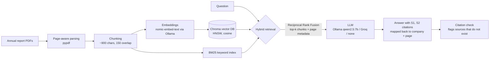

# Bursa Annual Report Risk Assistant

Ask questions about risks, internal control and audit matters in Malaysian listed companies' annual reports, and get answers that cite the exact report page. Runs fully locally and free (Ollama on a consumer GPU), or on any laptop with Groq's free tier.

> Built by Chong Jia You (Industrial Statistics, UTHM) as a portfolio project. It extends an internal-audit report extraction prototype I built during my internship into a retrieval system that can be evaluated.
>
> **Full write-up** (pain points, design decisions, comparison with other approaches, limitations): [docs/PROJECT_WRITEUP.md](docs/PROJECT_WRITEUP.md)

## The problem

Internal auditors, risk analysts and investors read annual reports of 200+ pages to answer narrow questions: *What are the principal risks? What did the Audit Committee review? What key audit matters did the external auditor raise?* Keyword search misses paraphrases ("stock shortage" vs "inventory loss"), and a chatbot without sources cannot be trusted in an audit setting.

This project answers from the reports only, cites every claim as `[company, page]`, says "Not found" when the reports do not contain the answer, and **measures** how often retrieval finds the right page.

## Architecture



| Layer | Choice | Why |
|---|---|---|
| Parsing | `pypdf`, one record per page | Keeps page numbers for citations |
| Chunking | Sentence-aware, overlapping | Avoids cutting a risk description in half |
| Embeddings | `nomic-embed-text` (Ollama), `bge-small` (optional), TF-IDF/LSA (offline fallback) | Free, local; fallback needs no download |
| Vector store | Chroma (HNSW index, cosine) | Persistent, no server needed |
| Keyword search | BM25 | Catches exact terms: company names, "RM", standard names |
| Fusion | Reciprocal Rank Fusion | Combines both rankings without tuning weights |
| Generation | Ollama (local), Groq (free tier) or none | Swappable by one setting; no paid API |
| Evaluation | Hit@k, Recall@k, MRR, citation precision, abstention | Shows whether it works, not just that it runs |

## Quick start

```bash
git clone https://github.com/programmermars/bursa-project.git
cd bursa-project
python -m venv .venv && source .venv/bin/activate      # Windows: .venv\Scripts\activate
pip install -e ".[dev]"
cp .env.example .env                                    # Windows: copy .env.example .env
```

**Try it in one minute with no downloads** (fictional sample report, keyword + LSA search, no LLM):

```bash
python scripts/make_sample_report.py
EMBED_BACKEND=tfidf LLM_PROVIDER=none rag ingest
EMBED_BACKEND=tfidf LLM_PROVIDER=none streamlit run app.py
```

**Full setup with real reports:**

1. Install [Ollama](https://ollama.com), then `ollama pull nomic-embed-text` and `ollama pull qwen2.5:7b`.
2. Put annual report PDFs in `data/raw/`, named `COMPANY_YEAR_anything.pdf` (see [data/README.md](data/README.md)).
3. `rag doctor` checks your setup.
4. `rag ingest` builds the index.
5. `streamlit run app.py`, or from the terminal: `rag ask "What are the principal risks?" --company KLK`.

No GPU? Set `LLM_PROVIDER=groq` and a free key from [console.groq.com](https://console.groq.com), or `LLM_PROVIDER=none` to show retrieved passages only. See [docs/HARDWARE.md](docs/HARDWARE.md).

## Evaluation

`eval/questions.csv` holds hand-labelled questions: the company, the question and the page(s) where the answer is. Leave `expected_pages` empty for questions the reports cannot answer (tests abstention). To find the pages, use `python scripts/find_pages.py "Audit Committee" "met" --company KLK`, which prints page numbers and short snippets.

```bash
rag eval                 # retrieval only: free, no LLM calls
rag eval --with-llm      # also checks citations and abstention using your LLM_PROVIDER
```

Results are written to [`eval/results.md`](eval/results.md), comparing BM25, vector and hybrid retrieval and listing every missed question.

| Metric | Meaning |
|---|---|
| Hit@k | Share of questions where a correct page is in the top k passages |
| Recall@k | Share of all correct pages that were retrieved |
| MRR | Average of 1 / rank of the first correct page (rewards ranking it first) |
| Citation precision | Share of the answer's citations that point to a correct page |
| Abstention accuracy | Share of unanswerable questions where the model says "Not found" |

## Project layout

```
src/rag/
  config.py      settings from environment / .env
  ingest.py      PDF -> page-aware chunks
  embeddings.py  ollama | hf | tfidf backends
  index.py       builds Chroma + BM25 index
  retrieve.py    vector, bm25, hybrid (RRF)
  generate.py    prompt, Ollama/Groq call, citation parsing
  evaluate.py    retrieval and generation metrics
  cli.py         rag ingest | ask | eval | doctor
app.py           Streamlit UI
scripts/         sample report generator, page finder for labelling
eval/            questions and results
tests/           pytest suite (runs in CI with no downloads)
```

## Limitations

- Tables and charts in PDFs are extracted as plain text, so numeric tables can be garbled.
- Scanned (image-only) pages are skipped; OCR is not included.
- Page numbers are PDF page indices, which can differ from the numbers printed on the page.
- Evaluation quality depends on the hand-labelled questions; the set is small.

## Next steps

- Re-ranking with a cross-encoder after hybrid retrieval
- Table-aware parsing for financial statements
- Structured extraction of each company's risk register to JSON, compared across companies

## References

Approach adapted from public tutorials: LangChain/Streamlit PDF chatbots, citation-aware RAG, and the Ragas evaluation framework. Annual reports are public documents of the respective companies and are not redistributed in this repository.

## License

MIT
