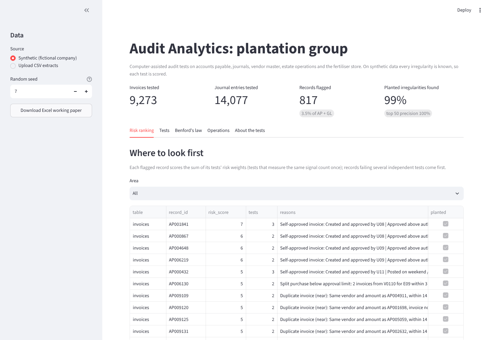
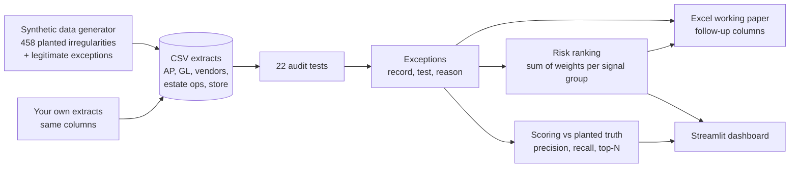
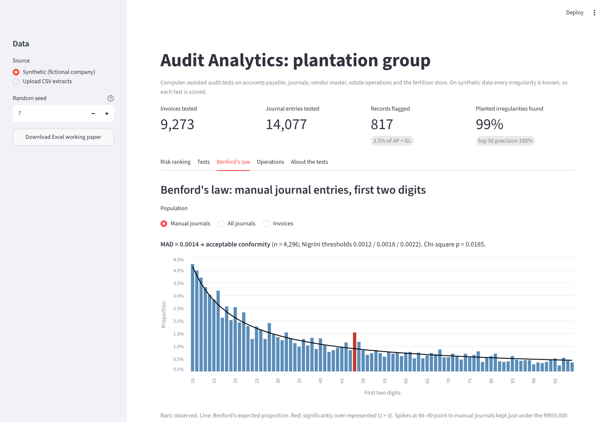
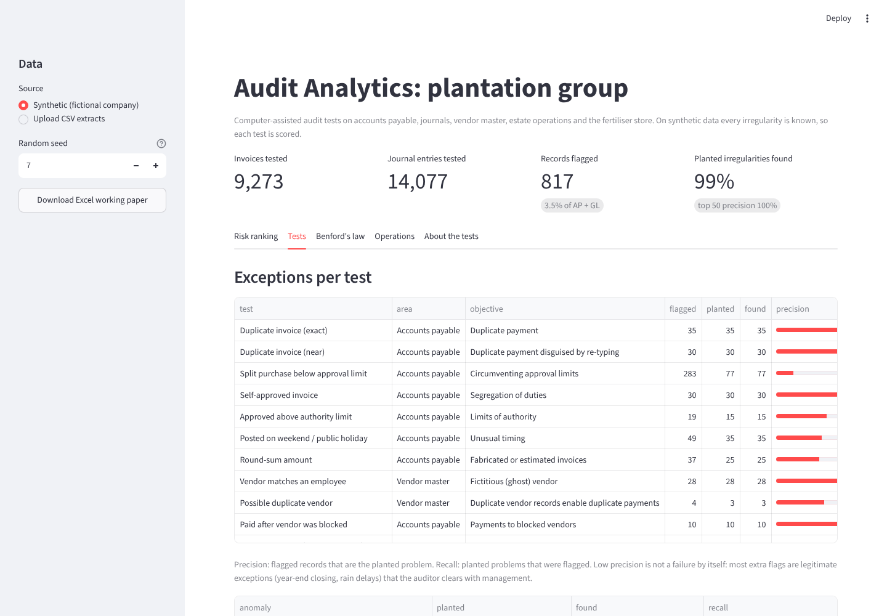

# Audit Analytics Toolkit: plantation group

Computer-assisted audit tests (CAATs) on a year of accounts payable, general ledger, vendor master, estate operations and fertiliser store data for a fictional Malaysian plantation group. Every irregularity in the data was planted on purpose and recorded, so each test is **scored**: how many real problems it finds and how many false alarms it raises. The output is an Excel working paper an internal auditor can follow up on, plus an interactive dashboard.

> Built by Chong Jia You (Industrial Statistics, UTHM). It grew out of my internal audit internship at a plantation group, where I compared planned and actual manuring and spraying, checked fertiliser store stock and flagged exceptions in Excel. This project does the same tests, and the standard accounts payable and journal entry tests, in reproducible Python with measured accuracy.



## The problem

Internal auditors cannot read every transaction. A mid-sized plantation group posts tens of thousands of invoices and journals a year, so auditors traditionally test a small sample, and a sample of 25 invoices will usually miss a duplicate payment or a ghost vendor.

| Pain point | In practice | What this project does |
|---|---|---|
| Sampling misses rare problems | 35 duplicate invoices in 9,000 are invisible in a sample of 25 | Tests 100% of the population |
| Too many exceptions to follow up | A weekend-posting test alone can flag dozens of legitimate year-end entries | Ranks records: those failing several independent tests come first |
| "Does the test actually work?" | Audit analytics are rarely validated; nobody knows the miss rate | Every test is scored against known planted problems, over 10 independent years |
| Fraud schemes hide under limits | Purchases split below the RM5,000 approval limit; journals kept under RM50,000 | Split-purchase, below-limit and Benford tests |
| Operational audits are manual | Planned vs actual manuring and fertiliser stock reconciled by hand in Excel | Automated variance, delay, unplanned-activity, stock-count and over-issue tests |
| Results must be documented | Auditors need evidence and follow-up status | Excel working paper with follow-up columns per exception |

## What is tested

22 tests across five areas. Each one states the risk it addresses.

| Area | Test | Risk addressed |
|---|---|---|
| Accounts payable | Duplicate invoice (exact; near: re-typed invoice no. or same amount within 14 days) | Duplicate payment |
| | Split purchase: 2+ invoices, same vendor and estate, within 3 days, each under RM5,000, total above it | Circumventing approval limits |
| | Self-approved invoice; approved above authority limit | Segregation of duties, limits of authority |
| | Posted on weekend / public holiday; round-sum amount | Unusual timing, fabricated invoices |
| | Paid after vendor was blocked | Payments to blocked vendors |
| | Isolation Forest on behavioural features | Unknown unusual patterns |
| Vendor master | Vendor bank account or address matches an employee | Ghost vendor |
| | Fuzzy-matched duplicate vendor names | Duplicate payments through duplicate records |
| General ledger | Manual JE outside office hours; by a non-GL user; red-flag wording ("per CFO", "plug") | Management override (ISA 240 requires journal entry testing for this) |
| | JE amount unusual for its account (robust z-score on log amount) | Material misstatement |
| | Benford first-two-digit test (Nigrini MAD thresholds) with drill-down; JE just below approval limit | Fabricated amounts, threshold avoidance |
| Estate operations | Planned vs actual quantity variance > 20%; activity > 30 days late; activity with no plan | Inputs not applied as planned, unauthorised activity |
| Fertiliser store | Physical count > 2% below book; issued > 5% above field application | Inventory loss, diversion of inputs |

## How it works



1. **Generate** (`src/auditkit/generate.py`): a year (FY ending 30 Sep 2025) for 20 estates: 9,000+ invoices with log-normal amounts (which follow Benford's law), 14,000 journals, 169 vendors, 80 employees, monthly manuring/spraying plans and actuals, fertiliser store movements. It plants 21 types of irregularity (458 records) and also adds **legitimate exceptions** that good tests will still flag: authorised weekend year-end closing, late-night month-end accruals, rain-delayed manuring, moisture loss in fertiliser, monthly rent at the same round amount, two genuinely different vendors with near-identical names.
2. **Test** (`src/auditkit/checks.py`): each test returns the flagged records with a plain-language reason, e.g. *"3 invoices from V0110 for E09 within 3 days, each below RM5,000, total RM12,431.20"*.
3. **Rank** (`src/auditkit/scoring.py`): each test has a risk weight; a record's score is the sum over **signal groups**, so two tests measuring the same thing (Benford spike and just-below-limit) count once.
4. **Score**: precision and recall per test against the planted truth, and precision of the top 25/50/100 ranked records.
5. **Report** (`src/auditkit/report.py`): Excel working paper with summary, risk ranking, one sheet per area with *Auditor / Status / Management explanation / Evidence ref.* columns, Benford table and test scoring.

## Results

One year (seed 7): 9,273 invoices and 14,077 journals tested; 817 records flagged (3.5%); **99% of the 458 planted irregularities flagged by at least one test; the top 50 ranked records are all real problems.** Full table: [output/results.md](output/results.md). Excel: [output/exceptions_report.xlsx](output/exceptions_report.xlsx).

Because one year can be lucky, `auditkit benchmark` repeats everything on 10 independently generated years ([output/benchmark.md](output/benchmark.md)):

| Test | Precision (mean ± sd) | Recall (mean) | Recall (worst year) |
|---|---|---|---|
| Duplicate invoice (exact / near) | 1.00 / 0.99 | 1.00 | 1.00 |
| Split purchase below approval limit | 0.43 ± 0.10 | 1.00 | 1.00 |
| Self-approved / above authority | 1.00 / 0.75 | 1.00 | 1.00 |
| Vendor matches an employee (ghost vendor) | 1.00 ± 0.00 | 1.00 | 1.00 |
| Possible duplicate vendor | 0.64 ± 0.13 | 1.00 | 1.00 |
| Manual JE outside office hours | 0.75 ± 0.00 | 1.00 | 1.00 |
| JE amount unusual for account | 0.75 ± 0.07 | 0.78 | 0.53 |
| **Benford first-two-digit spike** | 0.33 ± 0.13 | **0.45** | **0.00** |
| Manual JE just below approval limit | 0.60 ± 0.06 | 1.00 | 1.00 |
| Isolation Forest (all AP problems) | 0.36 ± 0.05 | 0.12 | 0.09 |
| Estate operations (3 tests) | 0.71–1.00 | 1.00 | 1.00 |
| Fertiliser store (2 tests) | 0.71–1.00 | 1.00 | 1.00 |
| **Top 50 risk-ranked records** | **0.99** (min 0.98) | | |



## What I learned

- **Benford's law is a screen, not a detector.** The first-two-digit chart clearly shows the spike at 48–49 (journals kept under the RM50,000 limit), but the drill-down caught only 45% of them on average and none in the worst year: 40 planted journals among ~4,300 sit at the edge of statistical significance. The targeted follow-up test (journals within 5% below the limit) caught 100%. Use Benford to decide *where* to look, then test that place directly.
- **Rule-based tests beat the machine learning model here.** Isolation Forest found only 12% of the accounts payable problems, because most fraud schemes look normal on any single feature. Its value is finding patterns no rule was written for, so it is kept with a low weight.
- **Precision below 1 is normal and useful.** Most extra flags are the legitimate exceptions built into the data. In a real audit these become *"explained by management"* entries; the ranking makes sure the auditor sees real problems first.
- **Correlated tests must not double-count.** Adding the below-limit test first dropped top-50 precision from 0.99 to 0.86, because a legitimate RM49,000 journal failed two tests measuring the same thing. Scoring by signal group restored it to 0.99.



## Quick start

```bash
cd audit-analytics
pip install -e ".[dev]"
auditkit generate            # synthetic data -> data/
auditkit run                 # tests, scoring, Excel -> output/
auditkit benchmark --seeds 10
streamlit run app.py         # dashboard
pytest -q                    # 11 tests
```

**On real data:** export the tables as CSV with the same columns as `data/` (run `auditkit generate` to see them), then `auditkit run --data path/to/extracts`. Without `truth.csv`, scoring is skipped and you get the exceptions and the Excel working paper. Thresholds (approval limits, windows, tolerances) are parameters of each test in `checks.py`.

## Project layout

```
src/auditkit/
  generate.py   synthetic data with planted irregularities and legitimate exceptions
  checks.py     22 audit tests (CAATs), each returning flagged records with reasons
  benford.py    first-two-digit Benford test, Nigrini MAD thresholds, z-statistics, chi-square
  scoring.py    precision/recall per test, coverage, risk ranking with signal groups
  report.py     Excel working paper
  cli.py        auditkit generate | run | benchmark
app.py          Streamlit dashboard (synthetic data or uploaded CSV extracts)
tests/          pytest suite
```

## Limitations

- The data is synthetic. The irregularities follow schemes described in audit literature, but real fraud adapts to the tests used; the scores show the tests work as designed, not their real-world hit rate.
- Holidays are an approximate Perak list for FY2025.
- Approval matrix and user roles are simplified; real ERP data needs mapping (e.g. SAP tables BKPF/BSEG for journals, LFA1 for vendors).

## References

- Nigrini, M. (2012). *Benford's Law: Applications for Forensic Accounting, Auditing, and Fraud Detection*. Wiley.
- ISA 240, *The Auditor's Responsibilities Relating to Fraud in an Audit of Financial Statements* (journal entry testing for management override).
- ACFE, *Occupational Fraud: A Report to the Nations* (billing schemes, shell companies, duplicate payments).
- Liu, Ting & Zhou (2008). *Isolation Forest*. IEEE ICDM.

## License

MIT. All companies, people and figures are fictional.
