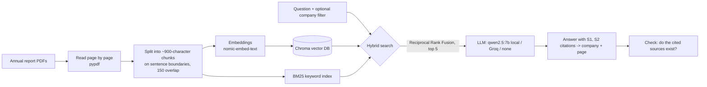

# Project write-up: Bursa Annual Report Risk Assistant

How and why I built a question-answering system over Malaysian listed companies' annual reports, the decisions behind it, how it compares with other approaches, and what still does not work.

*Author: Chong Jia You (Industrial Statistics, UTHM). Code: this repository. Results: [`eval/results.md`](../eval/results.md).*

---

## 1. One-paragraph summary

Auditors, risk analysts and investors read 200+ page annual reports to answer a few narrow questions: *What are the principal risks? How many times did the Audit Committee meet? What key audit matters did the auditor raise?* I built a retrieval-augmented generation (RAG) system that answers these questions **only from the reports**, cites every claim as **company + page**, replies **"Not found"** when the reports do not say, and is **measured** on a hand-labelled question set. It runs free: locally on a 6 GB GPU (Ollama), or on any laptop through Groq's free tier, or with no AI model at all (search only).

## 2. The problem and pain points

I came to this from an internal-audit internship where I extracted findings from audit reports by hand. The same pains show up when reading annual reports:

| # | Pain point | What it looks like in practice | How this project responds |
|---|---|---|---|
| 1 | **Length** | A Bursa Main Market annual report is often 150–300 pages; the risk and governance answers are in maybe 10 of them (Statement on Risk Management and Internal Control, Audit Committee Report, auditor's report, sustainability statement). | Search the whole report and return only the top 5 passages. |
| 2 | **Same idea, different words** | One company writes "labour shortage", another "workforce availability"; Ctrl+F finds one but not the other. | Meaning-based (vector) search. |
| 3 | **Exact terms matter too** | "RM", "MFRS 9", company names and figures are where meaning-based search is weak. | Keyword (BM25) search, combined with vector search. |
| 4 | **Trust** | In audit work an answer without a source is not usable; every statement must be traceable. | Each sentence carries a `[S1]` citation that maps to company + page; the UI shows the passage and flags citations that do not exist. |
| 5 | **Made-up answers** | General chatbots answer confidently even when the report says nothing. | The prompt forces "Not found in the provided reports."; this is measured (abstention accuracy). |
| 6 | **Cost and data control** | Paid APIs are a barrier for students and small firms, and some users do not want to send documents to a cloud model. | Local models via Ollama; Groq free tier as a fallback; no paid API anywhere. |
| 7 | **"It runs" is not "it works"** | Most RAG demos never check accuracy. | A labelled question set and retrieval + generation metrics, plus a list of the questions it misses. |

**Who it is for:** internal auditors and audit associates doing background research, risk/ESG analysts comparing companies, and students learning to read annual reports.

## 3. How it works



Step by step:

1. **Ingest** (`src/rag/ingest.py`). Each PDF page is read separately so every chunk keeps its page number. The filename (`KLK_2025_annual_report.pdf`) gives company and year. Pages with under 40 characters of text (covers, photos, scans) are skipped.
2. **Chunk.** Text is split on sentence/paragraph boundaries into ~900-character pieces with 150 characters of overlap, so a risk description is rarely cut in half.
3. **Index** (`src/rag/index.py`). Two indexes over the same chunks: a Chroma vector store (cosine similarity, HNSW) and a BM25 keyword index.
4. **Retrieve** (`src/rag/retrieve.py`). Both indexes return their top 20; **Reciprocal Rank Fusion** merges them (score = Σ 1/(60 + rank)). RRF needs no weight tuning, which matters because the label set is too small to tune on. A company filter restricts search to one report.
5. **Generate** (`src/rag/generate.py`). The top 5 passages are numbered `[S1]…[S5]` with company and page. The model is told to answer only from them, cite after every sentence, and say "Not found" otherwise. Temperature is 0. Citations are parsed back to pages; citations to non-existent sources are flagged.
6. **Evaluate** (`src/rag/evaluate.py`). See section 6.

## 4. Key design decisions and why

| Decision | Alternatives considered | Why this one |
|---|---|---|
| Page-level parsing with `pypdf` | Unstructured, Docling, LlamaParse | Page numbers are needed for citations; pypdf is light and free. Tables suffer (see limitations). |
| Hybrid BM25 + vector with RRF | Vector only; weighted score blend | Vector-only misses exact terms; blending raw scores needs tuning I cannot do reliably on ~24 questions. |
| `nomic-embed-text` via Ollama | OpenAI embeddings, bge-small | Free, runs on the same Ollama server as the LLM; bge-small and an offline TF-IDF/LSA backend are available as options. |
| `qwen2.5:7b` (4-bit) | Llama 3.1 8B, GPT-4o | Fits in 6 GB VRAM, follows citation instructions well for its size, free. |
| Chroma | FAISS, pgvector, Pinecone | Persistent on disk, no server, enough for a few thousand chunks. |
| Hand-labelled pages as ground truth | LLM-as-judge (Ragas) | Page labels are objective and cheap to check; no judge model bias or API cost. |
| Offline TF-IDF backend | — | Lets tests run in CI and lets anyone try the app with zero downloads. |

## 5. How others approach this, and where this project fits

| Approach | Example | Strength | Weakness | What I took from it |
|---|---|---|---|---|
| "Chat with your PDF" tutorials | LangChain / LlamaIndex + Streamlit demos | Fast to build | Usually vector-only, no page citations, no measurement | The basic pipeline and Streamlit UI |
| Financial QA benchmarks | FinanceBench (Patronus AI, 2023) on US 10-K filings | Shows real difficulty: the paper reports that GPT-4-Turbo with a shared retrieval store answered incorrectly or refused on most questions | US filings, not Bursa; focused on numbers | Annual-report QA is hard; measure it and expect failures, especially on tables |
| RAG evaluation frameworks | Ragas (faithfulness, context recall) | Standard metric names | Uses an LLM as judge (cost, bias) | Metric ideas; I use page labels instead of a judge |
| Hybrid search + rank fusion | Cormack et al. 2009 (RRF); common in Elasticsearch/Weaviate | Robust, no tuning | Two indexes to maintain | Used directly |
| Contextual Retrieval | Anthropic, 2024: add a short context to each chunk before indexing, plus BM25 and re-ranking | Large reported drop in retrieval failures | One LLM call per chunk at index time | Planned next step (cheap version: prefix company + section title) |
| Re-ranking | Cross-encoders such as bge-reranker | Better top-1 accuracy | Extra model, slower | Planned next step |
| Layout-aware parsing | Docling, pdfplumber, Camelot | Tables survive | Heavier setup | Planned for financial-figure questions |

**What is different here:** focused on Bursa Malaysia reports and on audit/risk sections, page-level citations checked automatically, an explicit "Not found" metric, and it is fully free and local.

## 6. How it is evaluated

**No hand labelling needed.** `rag run` (or the app's upload button) writes the question set itself: `src/rag/autolabel.py` asks the same 8 question types of every report: principal risks, foreign exchange risk, Audit Committee meetings, internal audit function (in-house/outsourced, reporting line), internal audit cost, key audit matters, climate/sustainability risk and revenue. It finds the correct pages with keyword rules: a page counts when it contains every required phrase group (e.g. "Audit Committee" + "meeting/met"), and the best-matching 1–3 pages are kept. Each report also gets one question it cannot answer (e.g. cryptocurrency policy), kept only if the topic really does not appear in that report.

These are *weak labels*. On the fictional sample they match the hand labels exactly, but on real reports a rule can pick a page that only mentions the topic. Because the labels come from keywords they also favour BM25 search, so the comparison is indicative. For publishable numbers, put hand-checked questions in `eval/questions.csv` (columns `id, company, question, expected_pages`; blank pages = unanswerable). `rag run` uses that file instead whenever it has rows. `scripts/find_pages.py` helps check pages quickly.

| Metric | Question it answers |
|---|---|
| Hit@5 | Did a correct page appear in the top 5? |
| Recall@5 | What share of all correct pages was found? |
| MRR | How high was the first correct page ranked? |
| Citation validity | Did the model only cite sources it was given? |
| Citation precision | Do the cited pages actually contain the answer? |
| Abstention accuracy | Does it say "Not found" for unanswerable questions? |

`rag eval` compares BM25, vector and hybrid side by side and lists every missed question with retrieved vs expected pages, so the failures are visible, not just the averages.

## 7. Results

Filled in automatically by `rag run` after the reports are uploaded.

<!-- RESULTS:START -->
*Last run: 2026-10-07 by `rag run`. Questions: auto-labelled (keyword rules). Search: `tfidf-lsa`. Answers: `none`.*

| Report | Pages (with text) |
|---|---|
| DemoPlantation 2025 | 6 (6) |

| Search mode | Questions | Hit@5 | Recall@5 | MRR |
|---|---|---|---|---|
| bm25 | 7 | 1.00 | 1.00 | 0.90 |
| vector | 7 | 1.00 | 1.00 | 0.83 |
| hybrid | 7 | 1.00 | 1.00 | 0.83 |

Chunk size 600 vs 900 (hybrid): Hit@5 1.00 vs 1.00, MRR 0.90 vs 0.83.

Best search mode: **bm25**. Hybrid missed 0 question(s). Details in [eval/results.md](../eval/results.md).

> These numbers come from the fictional sample report and only show that the pipeline works. Upload real annual reports and run `rag run` to replace them.

> Correct pages were found by keyword rules (`src/rag/autolabel.py`), not checked by hand, which favours keyword (BM25) search. Treat them as indicative.
<!-- RESULTS:END -->

## 8. Limitations (honest list)

- **Tables.** Financial statements are extracted as flat text; figure questions are the most likely to fail.
- **Scanned pages** are skipped (no OCR).
- **Page numbers** are PDF page indices, which can differ from the number printed on the page.
- **Small label set.** About 24 questions over 3 reports; differences of one or two questions are noise.
- **Small local model.** A 7B model can miss citations or over-summarise; Groq's 70B model is the comparison point.
- **English only.** Bahasa Malaysia sections are not targeted.

## 9. Next steps

1. Re-ranking with a cross-encoder after hybrid search; measure the MRR change.
2. Cheap contextual retrieval: prefix each chunk with company, year and section heading.
3. Table-aware parsing (pdfplumber/Docling) for financial figures.
4. Structured extraction: each company's risk register as JSON, compared across companies and years.

## 10. Reproduce it

```bash
pip install -e ".[dev]"
python scripts/make_sample_report.py
EMBED_BACKEND=tfidf LLM_PROVIDER=none rag ingest
EMBED_BACKEND=tfidf LLM_PROVIDER=none rag eval --questions eval/sample_questions.csv
```

With real reports: see the README Quick start and [`docs/HARDWARE.md`](HARDWARE.md).

## References

- Lewis et al. (2020), *Retrieval-Augmented Generation for Knowledge-Intensive NLP Tasks*.
- Cormack, Clarke & Büttcher (2009), *Reciprocal Rank Fusion outperforms Condorcet and individual rank learning methods*.
- Robertson & Zaragoza (2009), *The Probabilistic Relevance Framework: BM25 and Beyond*.
- Islam et al. (2023), *FinanceBench: A New Benchmark for Financial Question Answering* (Patronus AI).
- Es et al. (2023), *Ragas: Automated Evaluation of Retrieval Augmented Generation*.
- Anthropic (2024), *Introducing Contextual Retrieval*.
- Bursa Malaysia Main Market Listing Requirements and the Malaysian Code on Corporate Governance, for the report sections targeted.
